# Task Management MVP — Software Architecture

> **Stack:** Node.js (Express) + React · In-memory storage (v1) · JWT authentication  
> **Date:** 2026-03-24  
> **Spec version:** OpenAPI 3.0.3 v1.0.0

---

## Table of Contents

1. [Architecture Overview Diagram](#1-architecture-overview-diagram)
2. [Class / Model Diagrams](#2-class--model-diagrams)
   - 2.1 [Domain Models](#21-domain-models)
   - 2.2 [DTOs (Request / Response Shapes)](#22-dtos-request--response-shapes)
   - 2.3 [Controllers → Services → Repositories](#23-controllers--services--repositories)
3. [Sequence Diagrams](#3-sequence-diagrams)
   - 3.1 [Login](#31-login)
   - 3.2 [Logout](#32-logout)
   - 3.3 [Create User (Admin)](#33-create-user-admin)
   - 3.4 [List / Get Users (Admin)](#34-list--get-users-admin)
   - 3.5 [Create Task](#35-create-task)
   - 3.6 [List Tasks with Filters](#36-list-tasks-with-filters)
   - 3.7 [Update Task Details](#37-update-task-details)
   - 3.8 [Update Task Status (Lifecycle Transition)](#38-update-task-status-lifecycle-transition)
   - 3.9 [Assign / Reassign Task](#39-assign--reassign-task)
   - 3.10 [Status Summary Report](#310-status-summary-report)
   - 3.11 [Overdue Tasks Report](#311-overdue-tasks-report)
   - 3.12 [Productivity Report](#312-productivity-report)
   - 3.13 [Trend Report](#313-trend-report)

---

## 1. Architecture Overview Diagram

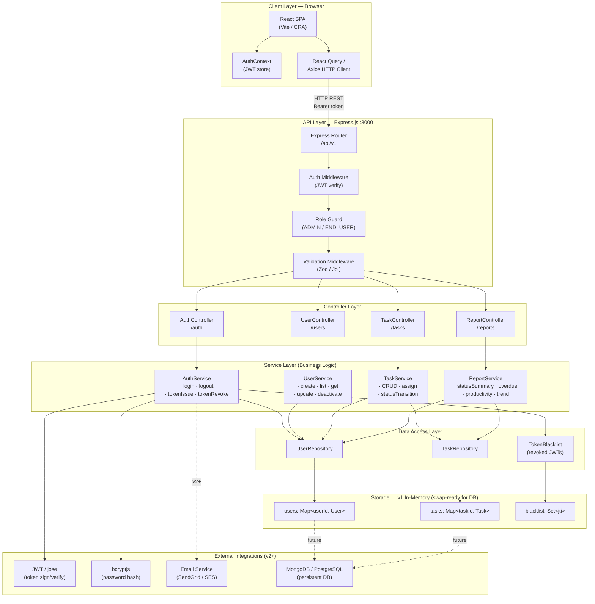

**Explanation**

| Layer | Responsibility |
|---|---|
| **React SPA** | Renders UI, stores JWT in `AuthContext`, issues HTTP requests via Axios / React Query. |
| **Express Router** | Mounts versioned routes (`/api/v1`), applies middleware chain before reaching controllers. |
| **Auth Middleware** | Validates `Authorization: Bearer <JWT>`, extracts `userId` + `role` onto `req.user`. |
| **Role Guard** | Asserts required role(s) per route (e.g. `ADMIN`-only for `/users`). |
| **Validation Middleware** | Schema-validates request body / query params; returns `400 BAD_REQUEST` on failure. |
| **Controllers** | Thin HTTP adapters — parse request, call service, map result to HTTP response. |
| **Services** | All business logic: lifecycle rules, ownership checks, pagination, report calculations. |
| **Repositories** | Pure data-access objects; abstract the storage medium. Swappable with Mongoose/Prisma for v2. |
| **In-Memory Maps** | `Map` and `Set` stores used in v1 for zero-dependency local development. |
| **External** | `bcryptjs` for password hashing at creation/login; `jose` / `jsonwebtoken` for JWT; futures: SendGrid, MongoDB. |

---

## 2. Class / Model Diagrams

### 2.1 Domain Models

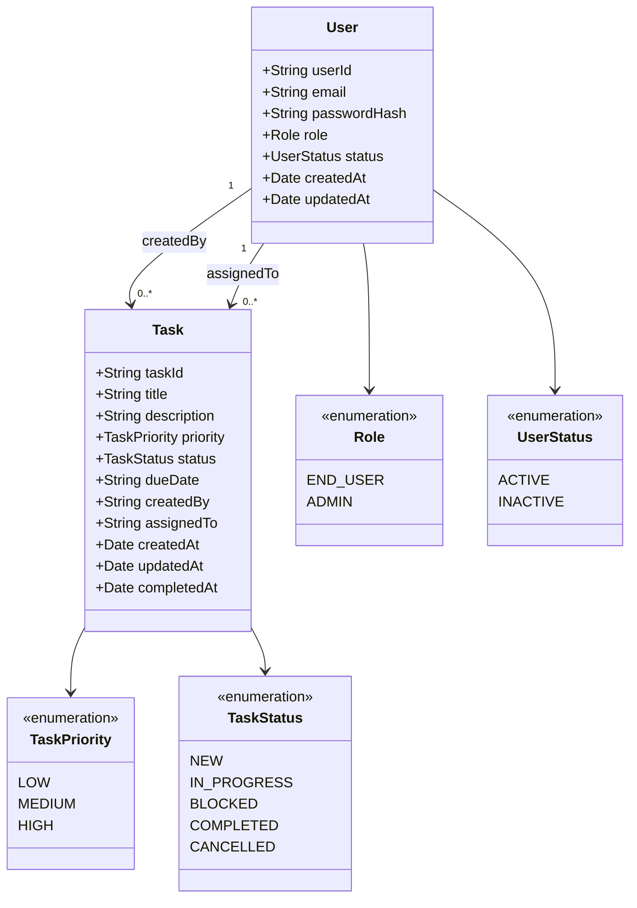

**Explanation:** `User` and `Task` are the two core domain entities. All relations are expressed via IDs (no embedded foreign-key objects in v1). Enumerations are modelled as separate types shared across request/response schemas.

---

### 2.2 DTOs (Request / Response Shapes)

```mermaid
classDiagram
    direction TB

    class LoginRequest {
        +String email
        +String password
    }

    class LoginResponse {
        +String accessToken
        +String tokenType
        +Number expiresInSeconds
        +User user
    }

    class UserCreateRequest {
        +String email
        +String password
        +Role role
        +UserStatus status
    }

    class UserUpdateRequest {
        +Role role
        +UserStatus status
    }

    class UserListResponse {
        +User[] data
        +PaginationMeta pagination
    }

    class TaskCreateRequest {
        +String title
        +String description
        +TaskPriority priority
        +String dueDate
        +String assignedTo
    }

    class TaskUpdateRequest {
        +String title
        +String description
        +TaskPriority priority
        +String dueDate
    }

    class TaskStatusUpdateRequest {
        +TaskStatus status
    }

    class TaskAssignmentRequest {
        +String assignedTo
    }

    class TaskListResponse {
        +Task[] data
        +PaginationMeta pagination
    }

    class PaginationMeta {
        +Number page
        +Number pageSize
        +Number totalItems
        +Number totalPages
        +Boolean hasNextPage
        +Boolean hasPreviousPage
    }

    class ErrorResponse {
        +String code
        +String message
        +String timestamp
    }

    class MessageResponse {
        +String message
    }

    class StatusSummaryReport {
        +String scope
        +Date generatedAt
        +Number totalTasks
        +StatusCount[] statusCounts
    }

    class StatusCount {
        +TaskStatus status
        +Number count
    }

    class OverdueReport {
        +Date generatedAt
        +Task[] data
        +PaginationMeta pagination
    }

    class ProductivityReport {
        +String scope
        +String period
        +String fromDate
        +String toDate
        +Number totalCompleted
        +ProductivityPoint[] series
    }

    class ProductivityPoint {
        +String label
        +Number completedCount
    }

    class TrendReport {
        +String scope
        +String granularity
        +String fromDate
        +String toDate
        +TrendPoint[] points
    }

    class TrendPoint {
        +String label
        +Number createdCount
        +Number completedCount
    }

    LoginResponse *-- PaginationMeta
    UserListResponse *-- PaginationMeta
    TaskListResponse *-- PaginationMeta
    OverdueReport *-- PaginationMeta
    StatusSummaryReport *-- StatusCount
    ProductivityReport *-- ProductivityPoint
    TrendReport *-- TrendPoint
```

**Explanation:** DTOs are plain data bags that map 1-to-1 with the OpenAPI `requestBodies` and response schemas. They are kept distinct from domain models to decouple the HTTP contract from internal representation — especially important when `passwordHash` must never leave the service layer.

---

### 2.3 Controllers → Services → Repositories

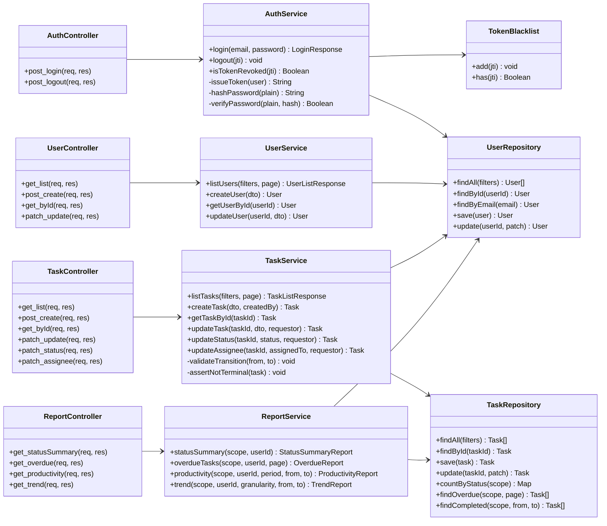

**Explanation:** Controllers are strictly HTTP-aware (parse request, call service, send response). All domain rules live in Services. Repositories are the only layer that touches the data store, making them trivially swappable with database adapters in v2.

---

## 3. Sequence Diagrams

### 3.1 Login

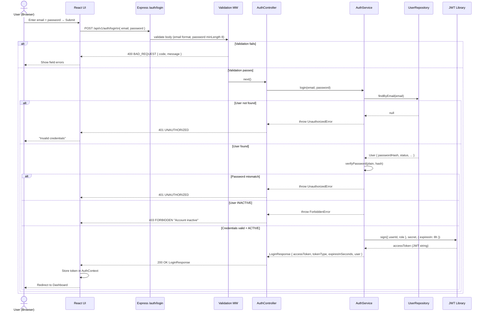

---

### 3.2 Logout

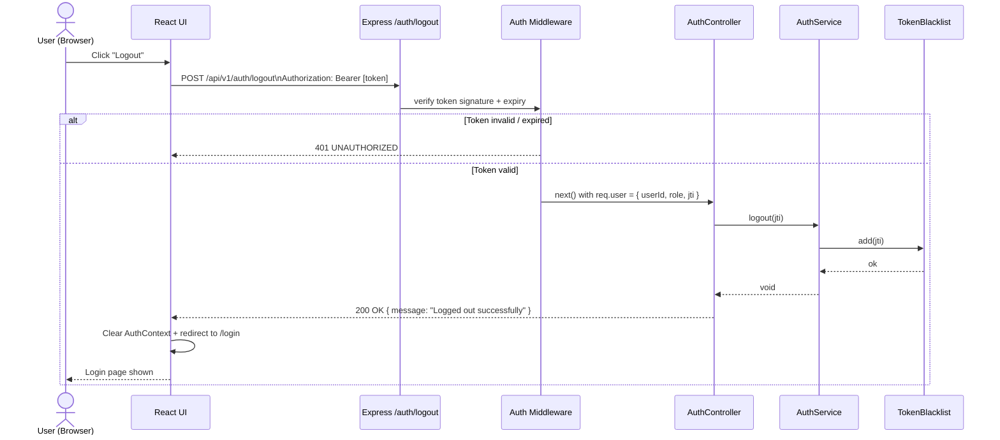

---

### 3.3 Create User (Admin)

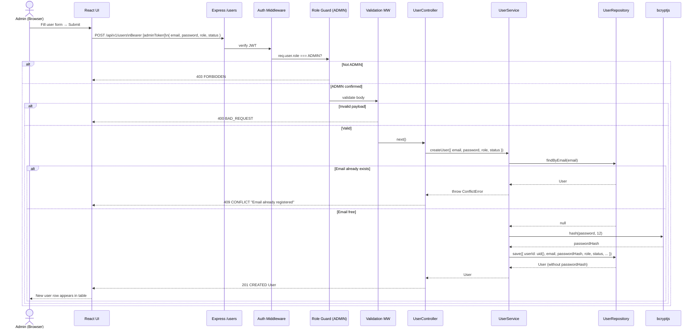

---

### 3.4 List / Get Users (Admin)

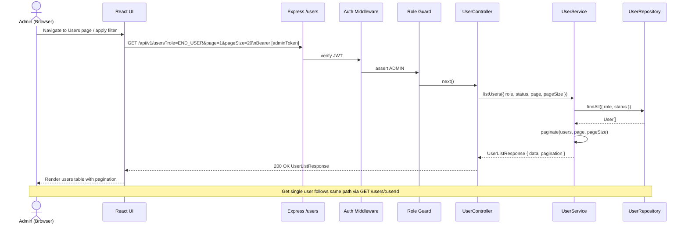

---

### 3.5 Create Task

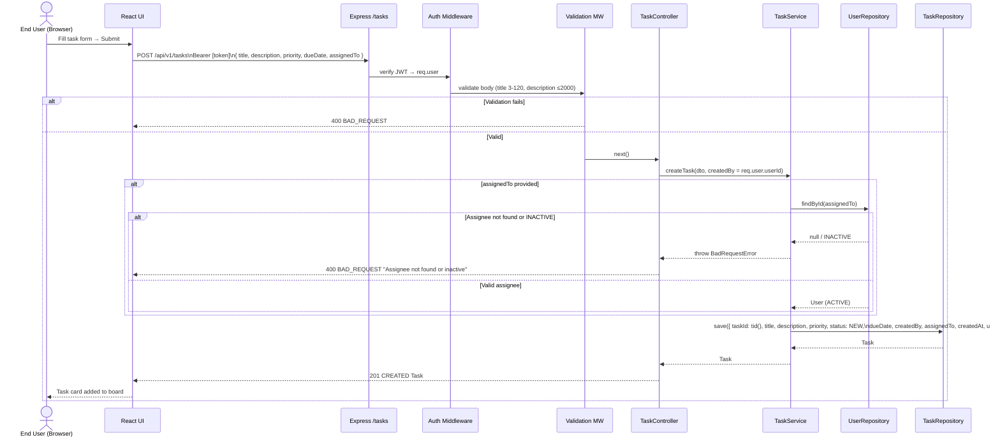

---

### 3.6 List Tasks with Filters

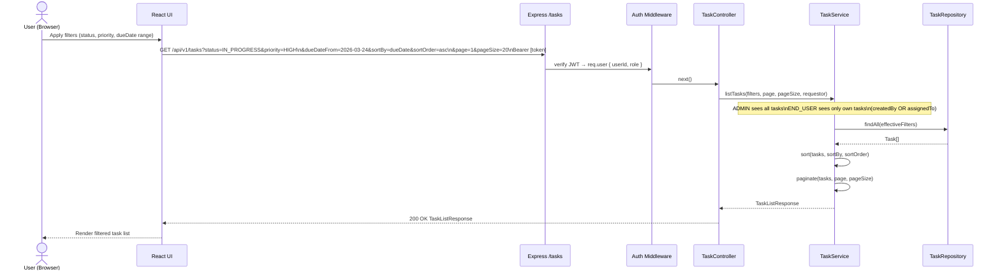

---

### 3.7 Update Task Details

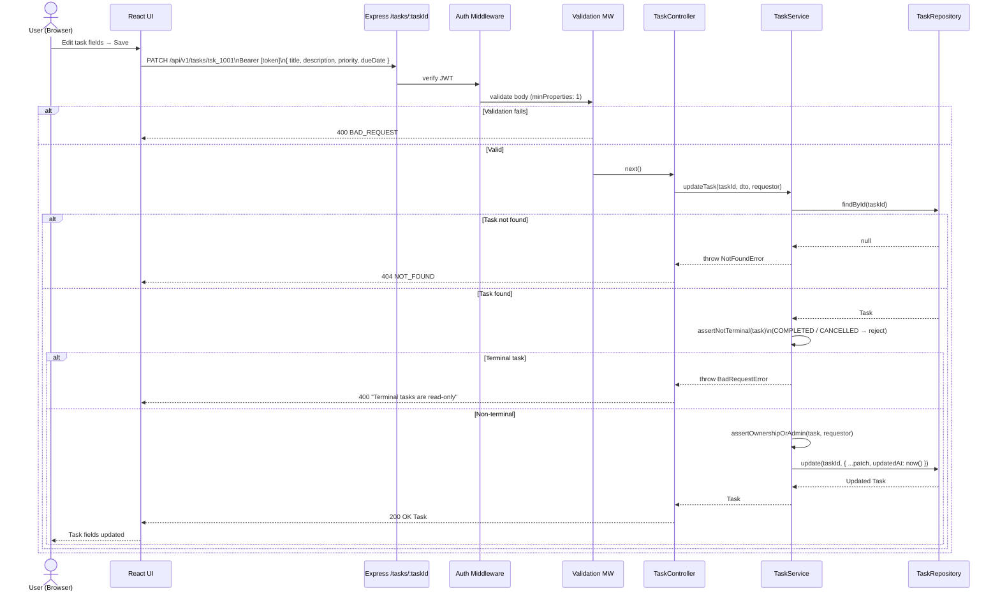

---

### 3.8 Update Task Status (Lifecycle Transition)

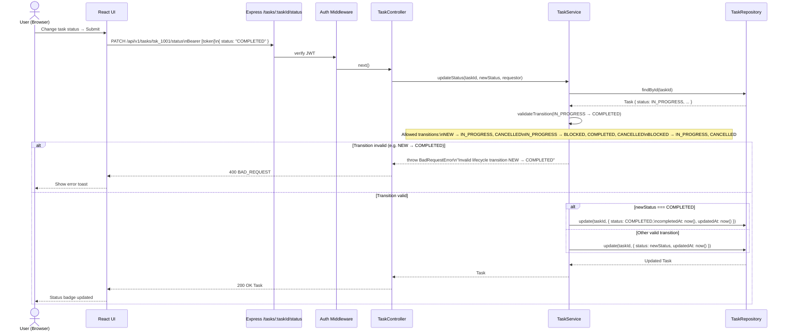

---

### 3.9 Assign / Reassign Task

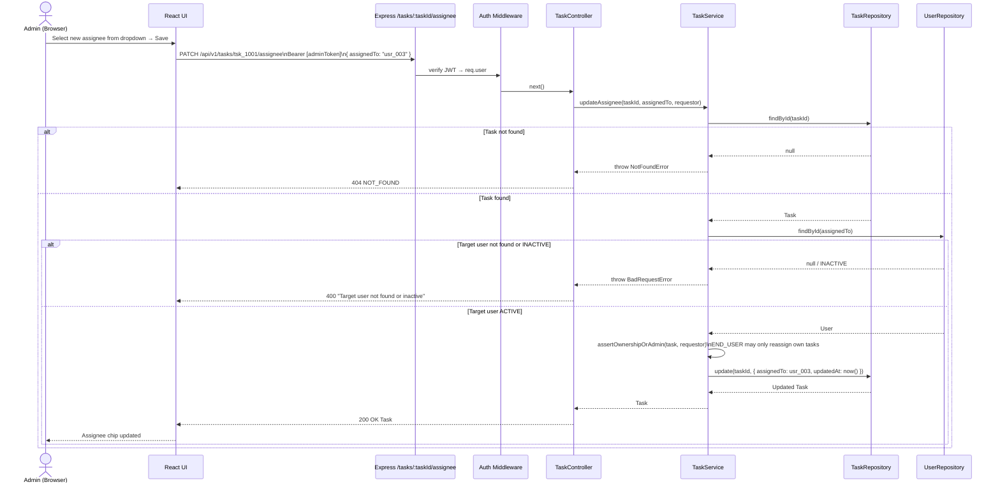

---

### 3.10 Status Summary Report

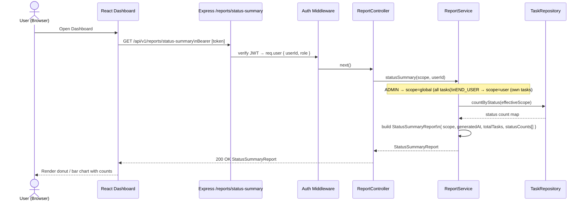

---

### 3.11 Overdue Tasks Report

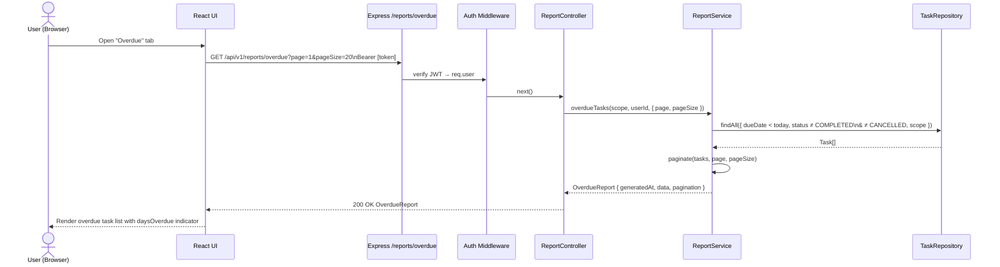

---

### 3.12 Productivity Report

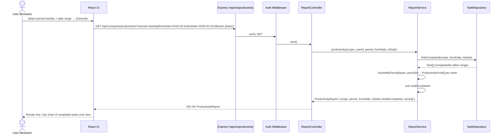

---

### 3.13 Trend Report

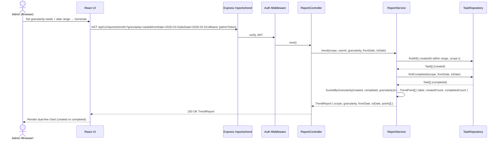

---

*End of Software Architecture Document*
